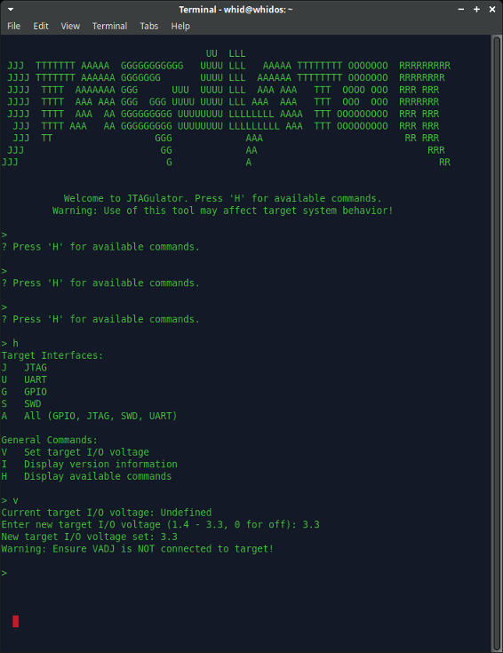
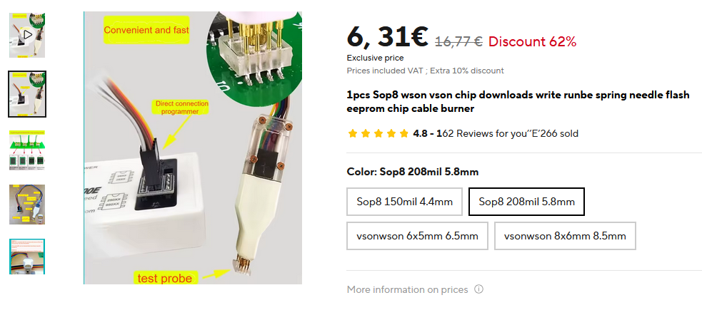

# WHIDBOARD
🔥😎🏴‍☠️ **WHIDBOARD: Plug it in, Set it up &amp; Get ready to Hack!** 🏴‍☠️😎🔥<br>
WHIDBOARD is the ultimate tool-suite for Hardware Hackers. It is designed to act as the perfect Swiss-Army-Knife for hacking any (I)IoT & Embedded devices.
Thanks to its core controller (a.k.a. **BRUSCHETTAPRO**) it can support the interaction with multiple protocols (i.e. UART, SPI, I2C, JTAG & SWD) as well as different Logic Levels (i.e. 1.8V, 2.5V, 3.3V and the VREF of the target itself). Nonetheless, it also allows the hacker to enumerate (UART, JTAG & SWD) thanks to its 24 channels' **Pin Enumerator** feature, as well as the ability to act as a 8 channels **Logic Analyzer** at 24MHz. <br>

 


## ​🇼​​🇭​​🇮​​🇩​​🇴​​🇸​ ​🇱​​🇮​​🇻​​🇪​ ​🇮​​🇸​​🇴​
  
  WHIDOS is a Linux-based Operative System preconfigured with all tools to work with WHIDBOARD and BRUSCHETTABOARD:<br>
  - Linux's Screen utility for BRUSCHETTAPRO's UART or PinEnumerator terminal
  - Flashrom to read SPI flash memories *
  - OpenOCD to use the JTAG & SWD *
  - SNANDer to read SPI NANDs & NORs memories *
  - UFPROG tool-suite (ufsnandprog,  ufsnandtest,  ufsnorprog and   ufsnortest)  to read SPI NANDs & NORs memories
  - Pulseview & Sigrok to use with the Logic Analyzer feature
  - All the utilities (i.e. fxload, propoloader, openspin, etc.) to build and flash both PinEnumerator and Logic Analyzer firmwares
    
      *Works both WHIDBOARD's BRUSCHETTAPRO or the classic BRUSCHETTABOARD<br>

      
  
  Plus some basic tools like:
  - Nmap & Zenmap
  - Wireshark
  - Ghidra
  - ZAP Proxy
  - Binwalk
  - Unblob
  
  The username and password are both: **whid**<br>
  
  You can find a copy of the ISO [here](https://drive.google.com/drive/folders/1BBXAXCxqmckBZOfDAAzAyk3inf9gF78c?usp=sharing).<br>


## ​🇧​​🇷​​🇺​​🇸​​🇨​​🇭​​🇪​​🇹​​🇹​​🇦​🇵​​🇷​​🇴 : MULTIPROTOCOL PROGRAMMER & DEBUGGER

### Logic Levels & Voltage Range
  The BRUSCHETTAPRO (i.e. part of the WHIDBOARD), supports the interaction with multiple protocols (i.e. UART, SPI, I2C, JTAG & SWD) as well as different Logic Levels (i.e. 1.8V, 2.5V, 3.3V and the VREF of the target itself). <br>
    𝐓𝐰𝐨 𝐭𝐡𝐢𝐧𝐠𝐬 𝐚𝐫𝐞 𝐯𝐞𝐫𝐲 𝐢𝐦𝐩𝐨𝐫𝐭𝐚𝐧𝐭: <br>
      1) You have to select the right Voltage **BEFORE** turning-on the DUT (Device Under Test) and **BEFORE** plugging-in the WHIDBOARD into the PC. <br>
      2) The operational range in case you prefer to use the DUT's Voltage Reference (i.e. VREF) must remain **within the 1.7V - 3.6V range**!!! **Remove Jumper and connect directly the 
external Voltage Reference to Pin 1** <br>

   

### 🐧LINUX
#### Udev Rules Configuration
  Copy [40-persistent-ch347.rules](https://github.com/whid-injector/WHIDBOARD/blob/main/Linux/40-persistent-ch347.rules) in the directory /etc/udev/rules.d <br>
  With the command: `sudo cp 40-persistent-ch347.rules /etc/udev/rules.d/`<br>
  Restart udev service with the command: `sudo udevadm control --reload-rules`

#### UART

  In order to use the WHIDBOARD as UART Serial debugger you need to use any preferred terminal tool. It is recommended to use the classic Screen Linux utility. <br>
  **Usage Example:** `sudo screen /dev/ttyACM1 115200`

#### SPI & I2C

  In order to use WHIDBOARD as SPI reader/programmer be sure you have the Jumper on the CS0-Cx as in the image below. <br>
  Nearby, there is also a DIP-switch to enable/disable the WP pin.<br>
  
  <br>
      
  + **SNANDer**<br>
      This is a tool for the BRUSCHETTAPRO to read/write both SPI & I2C flash memories. Its usage is pretty straight forward.  To compile SNANDer on Linux:
      ```
      sudo apt install mingw-w64 gcc-mingw-w64-x86-64 libusb-1.0-0-dev
      sudo ldconfig
      git clone https://github.com/whid-injector/SNANDer
      cd SNANDer
      ./build-for-linux.sh
      ```
      Now you can try if it works and then copy snander ELF into /usr/local/bin.<br>
      **Usage Examples:**<br>
      ```
      snander -i
      snander -E 24c08 -r I2C_Firmware_dump.bin
      snander -r SPI_Firmware_dump.bin
     ```

       <br>


  + **Flashrom**<br>
      This is yet another tool for the BRUSCHETTAPRO to read/write both SPI flash memories. Its usage is pretty straight forward.
      You can refer to the following [guide](https://www.flashrom.org/dev_guide/building_from_source.html#installing-dependencies-1) to compile Flashrom on Linux OR use the following instructions:
      ```sudo su
      apt-get install -y gcc meson ninja-build pkg-config python3-sphinx libcmocka-dev libpci-dev libusb-1.0-0-dev libftdi1-dev libjaylink-dev
      git clone https://github.com/whid-injector/flashrom-whidboard flashrom
      cd flashrom/
      meson setup builddir
      meson compile -C builddir
      meson test -C builddir
      cd builddir/
      dmesg -wr
      sudo ./flashrom -p ch347_spi  -r firmware.bin
      ```
      
      
      If everything works, then you can install system-wide:
      ```
      cd ..
      sudo meson install -C builddir
      ```


  + **ufprog**<br>
      One more tool to read SPI NOR and NAND chips. Here is an Example usage:
      ```
      sudo apt install libjson-c-dev libhidapi-dev libusb-dev libusb-1.0-0-dev
      git clone https://github.com/whid-injector/ufprog
      cd ufprog
      cmake -DCMAKE_BUILD_TYPE=None -DBUILD_PORTABLE=OFF -DCMAKE_INSTALL_PREFIX=/usr -B build
      cd build
      make
      sudo make install
      sudo cp -r /usr/share/ufprog/ /usr/lib/
      ```

      After that you can use it to read SPI flash chips like this:
      ```
      sudo ufsnandprog dev=ch347f-libusb ftl=none read raw spi.bin
      Universal flash programmer for SPI-NAND 1.0
      Author: Weijie Gao hackpascal@gmail.com
      
      Loaded controller plugin WCH CH347 (libusb)
      Opened interface device 'ch347f-libusb' using driver 'ch347-libusb'
      
      Manufacturer: XTX
      Part: XT26G01C
      Capacity: 128MB
      Page size: 2KB+128B
      Clock: 60MHz
      
      Reading from flash at page 0 (0x0), count 65536 (size 0x8000000) ...
      OOB: excluded. ECC: disabled.
      [========================================================================] 100%
      Time used: 59.09s, speed: 2.17MB/s
      Succeeded
      ```
      OR <br>
      ```
      sudo ufsnorprog dev=ch347f-libusb probe
      Universal flash programmer for SPI-NOR 1.0 
      Author: Weijie Gao <hackpascal@gmail.com>
      Loaded controller plugin WCH CH347 (libusb)
      Opened interface device 'ch347f-libusb' using driver 'ch347-libusb'

      Manufacturer:       Infineon/Cypress/Spansion
      Part:               S25FL064P
      Capacity:           8MB
      Clock:              60MHz

      JEDEC ID:           01 02 16 4D
      Block/Sector size:  64KB 
      Page size:          256B
      Max speed:          108MHz
      Protocol:           SPI
      Read I/O:           1-1-1
      Write I/O:          1-1-1
      
      Sector Map:
          128KB ( 4KB 8KB 64KB )
          8064KB ( 64KB )
      ```

#### JTAG & SWD

You can find copy of the WHIDBOARD's config files for both SWD & JTAG  [here](https://github.com/whid-injector/WHIDBOARD/tree/main/Linux/openocd-linux). <br>

Using the BRUSCHETTAPRO part of WHIDBOARD as JTAG/SWD debugger is pretty straight forward. Either use WHIDOS ISO image or compile your own OpenOCD.

```
sudo apt install libtool pkg-config texinfo libusb-dev libusb-1.0-0-dev libftdi-dev autoconf automake make git libftdi* libhidapi-hidraw0 software-properties-common  apt-transport-https ca-certificates
sudo ldconfig
cd ~/
git clone --recursive https://github.com/whid-injector/openocd-linux temporary
cd temporary
chmod -R 755 OpenOCD_SourceCode_CH347/
cd OpenOCD_SourceCode_CH347
sudo ./bootstrap
sudo autoreconf --force --install
sudo ./configure --disable-doxygen-html --disable-doxygen-pdf --disable-gccwarnings --disable-wextra --enable-ch347
sudo make
cd /src
sudo ./openocd --version
cd ..
sudo make install
```
Now you can remove the "temporary" folder and use OpenOCD.


**Usage Example:** <br>
`sudo openocd -f WHIDBOARD_JTAG.cfg -f target.cfg`<br>
`sudo openocd -f WHIDBOARD_SWD.cfg -f target.cfg`<br>

 

### 🪟WINDOWS

#### Drivers Installation
  To use the BRUSCHETTAPRO on a Windows OS do install the driver [CH341PAR.EXE](https://github.com/whid-injector/WHIDBOARD/blob/main/Windows/Drivers/CH341PAR.EXE) <br>

#### UART
  When plugging WHIDBOARD [after installing the correct drivers as recommended above... It will spawn 2 different COM ports. One it is hard-wired to the Pin Enumerator feature (i.e. JTGR) and communicates with a baudrate of 115200bps. The other COM port, will be avialable to be connected at the UART's target device through TX & RX pins on the PCB]. Any serial terminal tool for Windows can be used at this point. I personally recommend [Putty](https://www.chiark.greenend.org.uk/~sgtatham/putty/latest.html). <br>

#### SPI & I2C
  + **WHIDBOARD Windows Tool**<br>
    This is a pre-compiled (GUI-based) tool for the BRUSCHETTAPRO to read/write both SPI & I2C flash memories. Its usage is pretty straight forward. You can find the sources [here](https://github.com/whid-injector/WHIDBOARD/tree/main/Windows/WHIDBOARD%20Tool/sourcecode).<br>
      
      
      
  + **SNANDer**<br>
    This is yet another pre-compiled tool for the BRUSCHETTAPRO to read/write both SPI & I2C flash memories. Its usage is pretty straight forward.
  
      Usage Example:<br>
      `snander.exe -i`<br>
      `snander.exe -r SPI_Dump_SNANDer.bin`<br>
      `snander.exe -E 24c08 -r I2C_24c08_Dump_SNANDer.bin`<br>
      
      
      
  
  + **Flashrom**<br>
    This is yet another pre-compiled tool for the BRUSCHETTAPRO to read/write SPI flash memories. Its usage is pretty straight forward.
  
      Usage Example:<br>
      `flashrom.exe -p ch347_spi -r firmware.bin`<br>


####  JTAG & SWD

You can find copy of precompiled OpenOCD.exe and copy of the WHIDBOARD's config files for both SWD & JTAG [here](https://github.com/whid-injector/WHIDBOARD/tree/main/Windows/opeoncd-win). <br> 

**Usage Example:** <br>
`openocd.exe -f WHIDBOARD_JTAG.cfg -f target.cfg`<br>
`openocd.exe -f WHIDBOARD_SWD.cfg -f target.cfg`<br>

## ​🇵​​🇮​​🇳​ 🇪​​🇳​​🇺​​🇲​​🇪​​🇷​​🇦​​🇹​​🇴​​🇷 (A.k.a. JTGR)
  	
The Pin Enumerator feature is based on the [JTAGULATOR](https://www.blackhat.com/docs/us-14/materials/arsenal/us-14-Grand-JTAGulator-Slides.pdf) design ([That reached End-of-Life and it has been discontinued AFAIK](https://www.parallax.com/product/jtagulator/)).
This tool is extremely useful to discover on-chip debug (OCD) interfaces. On-chip debug (OCD) interfaces can provide chip-level control of a target device and are a primary vector used by engineers, researchers, and hackers to extract program code or data, modify memory contents, or affect device operation on-the-fly. Depending on the complexity of the target device, manually locating available OCD connections can be a difficult and time consuming task, sometimes requiring physical destruction or modification of the device.

  Main Features:
  
+ Detection of UART serial, JTAG and SWD protocols' pins <br>
+ Adjustable target I/O voltage for level translation: 1.4 to 3.3 V <br>
+ 24 channels with input protection circuitry (i.e. both ESD and EM Filtering) <br>
+ Smooth interaction with OpenOCD (i.e. as JTAG/SWD debugger) and Pulseview (i.e. as a 24CH basic Logic Analyzer) <br>
+ USB interface for menu-based control from host computer (Windows, macOS, Linux) <br>   

### Flashing The Firmware
  
To flash new version of the JTAGULATOR firmware (available here https://github.com/grandideastudio/jtagulator) is **HEAVILY RECOMMENDED** to use Linux!

```
git clone https://github.com/grandideastudio/jtagulator
wget https://github.com/parallaxinc/PropLoader/releases/download/v1.0-37/proploader-linux.zip
unzip proploader-linux.zip 
chmod +x proploader
sudo cp proploader /usr/bin
cd jtagulator
```
   
**NOW PLUG-IN WHIDBOARD AND WAIT at least 60 seconds...**
  	
TEST LOAD IN RAM ONLY:
`sudo proploader -p /dev/ttyACM0 -v JTAGulator.eeprom` <br>
[IMPORTANT]: WAIT at least 60 seconds and then check if JTGR works: `sudo screen /dev/ttyACM0 115200`
  	
FLASH EEPROM:
`sudo proploader -p /dev/ttyACM0 -v -e JTAGulator.eeprom` <br>
[IMPORTANT]: WAIT at least 60 seconds and then check if JTGR works: `sudo screen /dev/ttyACM0 115200`

    <br>

(Note for Troubleshooting) In case you have issues in communicating with the Parallax MCU over ttyACM0... try "playing" with "JTGR Reset" button while using the commands above. With the right timing you can unbrick it! <br>

[OPTIONAL STEPS] IN CASE YOU WANT TO COMPILE YOUR OWN FW:
      
```
wget https://www.maccasoft.com/wp-content/downloads/openspin_1_00_81-linux-x86_64.tar.gz
tar -xzvf openspin_1_00_81-linux-x86_64.tar.gz
chmod +x openspin
sudo cp openspin /usr/bin
cd /home/whid/WHIDBOARD/JTGR/jtagulator
openspin -o JTGR.eeprom -e -v JTAGulator.spin
sudo proploader -p /dev/ttyACM0 -v -e JTGR.eeprom
```

### Use Cases
  	
To interact with the Pin Enumerator you have to plug the WHIDBOARD and connect to one of the two UART serial ports spawned. Usually in Linux is identified as /dev/ttyACM0.  <br>   
Usage example: `sudo screen /dev/ttyACM0 115200` then press any key and you will be welcomed by the JTAGULATOR menu. <br>
    
    
      <br>
        <br>
        <br>
        <br>
        <br>

**JTGR as Logic Analyzer (Not Recommended since is too slow):** <br>
The JTGR works ok on PulseView… BUT is too slow for anything usable… It's NOT FAST ENOUGH!!! <br>
Remember to close the serial terminal BEFORE opening Pulseview! You need to free the ttyACM0 connection between JTGR and Pulseview!!! Once done playing with JTGR + Pluseview… go back to the serial connection with SCREEN/PUTTY and press CTRL+X to exit the Logic Analyzer feature!!!

      <br>
        <br>
        <br>

## ​🇱​​🇴​​🇬​​🇮​​🇨​ ​🇦​​🇳​​🇦​​🇱​​🇾​​🇿​​🇪​​🇷​

This feature of WHIDBOARD supports a maximum sampling rate of up to 24MHz and can analyze more than a hundred different protocols. This makes it ideal for electronic engineers debugging tasks.<br>

### Hardware Introduction

This logic analyzer design is based on the Cypress CY7C6813A controller and its own the block-diagram is represented below:

    <br>

### Flashing the Firmware on Linux
You can find fxload and all firmwares needed, [here](https://github.com/whid-injector/WHIDBOARD/tree/main/Linux/fxload).
```
cd /home/whid/WHIDBOARD/fxload
sudo ./fxload -I fx2lafw-sigrok-fx2-8ch.ihx -D /dev/bus/usb/XXX/YYY -d 1d50:608c -c 0x1 -s Vend_Ax.hex -t fx2lp -v
```
Where XXX and YYY are taken from the "lsusb" command's output. <br>
XXX = Bus = 002 in the example below <br>
YYY = Device =  007 in the example below <br>
**Example:** <br>
```
Bus 002 Device 007: ID 04b4:8613 Cypress Semiconductor Corp. CY7C68013 EZ-USB FX2 USB 2.0 Development
```
**Example:** <br>
```
sudo ./fxload -I fx2lafw-sigrok-fx2-8ch.ihx -D /dev/bus/usb/002/007 -d 1d50:608c -c 0x1 -s Vend_Ax.hex -t fx2lp -v
```

### Use Cases
The Logic Analyzer feature of WHIDBOARD is compatible with PulseView/Sigrok on both [Linux](https://sigrok.org/wiki/Linux) & [Windows](https://sigrok.org/wiki/Windows).

    <br>

    <br>

## 3D Printed Case
  [Here](https://github.com/whid-injector/WHIDBOARD/tree/main/3D_Case) you can find the STL CAD file to print your own case for WHIDBOARD. <br>
  If you do not own a 3D printer... there are plenty of cheap services out there.  <br>
  If you live in EU, I do love the guys from [Craftrum](https://www.craftrum.eu), they already printed ton of cases for me 🥇 <br>
  The screws used are a 2x6mm Flat-Head Screws (e.g. https://s.click.aliexpress.com/e/_DEYh5yR) <br>
  
      <br>

## Compatible with the Following SOP8, SOP16, WSON8, WCSLP, etc. Adaptors
  https://s.click.aliexpress.com/e/_DFY8wcn <br>
      <br>
  
  https://s.click.aliexpress.com/e/_DmAewbN <br>
      <br>

  https://s.click.aliexpress.com/e/_DcZgEDr <br>
      <br>

  https://s.click.aliexpress.com/e/_DkWdSpp <br>
      <br>

  https://s.click.aliexpress.com/e/_DdUBzir <br>
      <br>
  
  https://s.click.aliexpress.com/e/_DEcb3Zl <br>
      <br>
  
  https://s.click.aliexpress.com/e/_DE1eEVh <br>
      <br>

## Tips & Tricks
  In case you plan to use WHIDBOARD on a VM I do recommend to enable the USB3.1 controller. <br>
   


## How To Report Bugs
  I won't spend time explaining in depth how to report issues, since I am pretty sure you have done it tons of times. 
  The main idea can be summed up in the following points:
  1. Expected Behavior
  2. Unexpected Behavior
  3. which OS you using?
  4. (Windows) Did you install the drivers before connecting?
  5. (Windows) Did you try all the tools? Multiprogrammer, BruschettaTool.exe and Flashrom?
  6. (Windows) Is the SPI/I2C flash connected properly? Is on-PCB? Or detached from the DUT?
  7. Is the target computer an Apple Product?
  8. Is the target USB port an USB3.0?
  9. Eventual Explanation Notes, Screenshots, Videos, etc.
